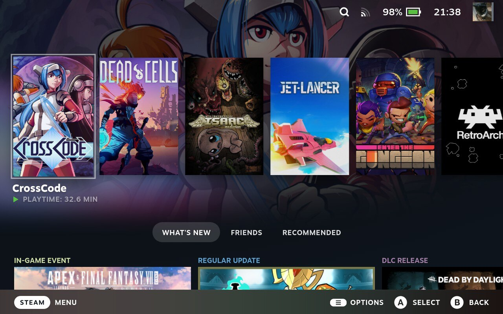

# Steam Deck Themes by zWolfrost
This repository will contain css themes developed by me for CSSLoader.

&nbsp;
## Remove Wide Banner
This theme will replace the banner of the last played game aka featured game with a capsule or a square, depending on your preference.
Unfortunately, this will require the banner image to become either cut, stretched or smaller, depending on your preference.
In order to ease this issue, i recommend setting the wide capsule images to square ones using steamgridb.

